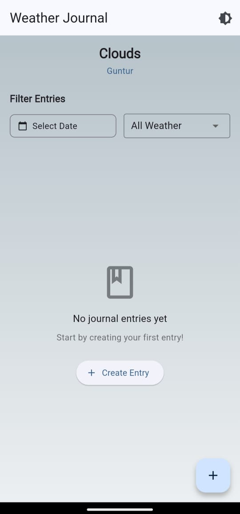
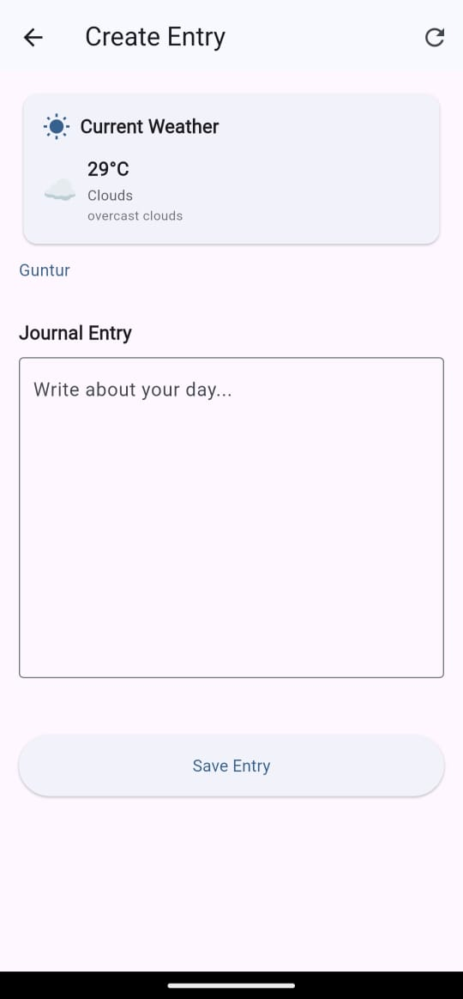
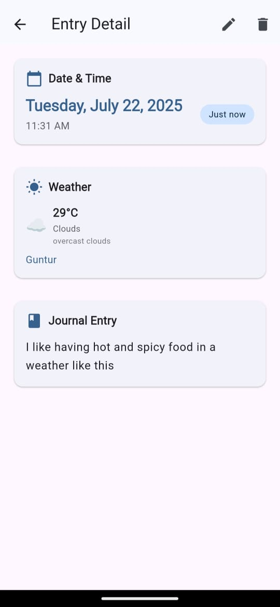

# Weather Journal App – Track Your Day

A Flutter app where users can record daily journal entries along with the weather for that day. The app fetches weather data from a public API and allows users to browse, filter, and view their past entries. This project showcases API integration, local storage, state management, and a clean user experience.

---

## 🚀 Overview
Create daily weather-linked journal entries. Browse, filter, and manage your entries with secure PIN authentication and a modern, responsive UI.

## 🛠️ Tech Stack
- **Flutter & Dart**
- **Local storage:** Hive, SharedPreferences, Flutter Secure Storage
- **Public REST API:** OpenWeatherMap
- **State management:** Provider

## ✨ Features
- PIN setup and session management (auto-lock, session timeout)
- Create, edit, delete journal entries
- Fetch and display weather data (live, location-based)
- Filter by date and weather
- Journal list and detail views
- Local data storage (Hive)
- Error handling and loading indicators
- Smooth navigation and transitions
- Dark mode support
- Unit & widget tests
- Weather-based themes 


## 🖥️ Main Screens
- **Home Screen:** Journal list, filter, create entry, live weather background
- **Create Entry:** Text input, live weather, save, city name
- **Entry Detail:** Full text, weather, city name, edit/delete
- **PIN Screen:** Secure login

## 🏗️ Project Structure
- `lib/models/` – Data models (journal, weather)
- `lib/providers/` – State management (auth, journal, theme)
- `lib/services/` – API, storage, weather logic
- `lib/screens/` – UI screens
- `lib/widgets/` – Reusable UI components
- `lib/utils/` – Constants, themes

## 📦 Setup Instructions
1. **Clone the repo:**
   ```bash
   git clone <your-repo-url>
   cd flutter_weather_journal
   ```
2. **Install dependencies:**
   ```bash
   flutter pub get
   ```
3. **Run the app:**
   ```bash
   flutter run
   ```
   (Supports Android, iOS, Web, Windows, MacOS, Linux)

4. **API Key:**
   - Get a free API key from [OpenWeatherMap](https://openweathermap.org/api)
   - Add your API key in `lib/services/weather_service.dart`

## 🧪 Testing
- Run all tests:
  ```bash
  flutter test
  ```
- Includes unit and widget tests for core logic and UI

## 📸 Screenshots

### Lock Screen (PIN)


### Home Screen


### Create Entry Screen


### Entry Detail Screen


## 📱 APK Build & Submission
- Build release APK:
  ```bash
  flutter build apk --release
  ```
- Submit the APK and source code as per instructions

## �� License
MIT

---
